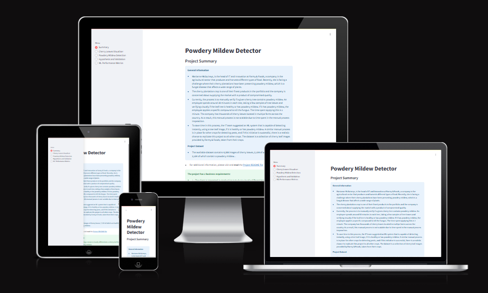
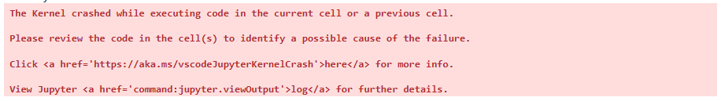

## Introduction

Powdery Mildew Detector is a Data Analytics app that is used for specific requirements by a fictional company.

## Dataset Content

- The dataset is sourced from [Kaggle](https://www.kaggle.com/codeinstitute/cherry-leaves). We then created a fictitious user story where predictive analytics can be applied in a real project in the workplace.
- The dataset contains over 4,000 images taken from the client's crop fields. The images show healthy cherry leaves and cherry leaves that have powdery mildew, a fungal disease that affects many plant species. The cherry plantation crop is one of the finest products in their portfolio, and the company is concerned about supplying the market with a compromised quality product.

## Business Requirements

The cherry plantation crop from Farmy & Foods is facing a challenge where their cherry plantations have been presenting powdery mildew. Currently, the process is manual verification if a given cherry tree contains powdery mildew. An employee spends around 30 minutes in each tree, taking a few samples of tree leaves and verifying visually if the leaf tree is healthy or has powdery mildew. If there is powdery mildew, the employee applies a specific compound to kill the fungus. The time spent applying this compound is 1 minute. The company has thousands of cherry trees located on multiple farms across the country. As a result, this manual process is not scalable due to the time spent in the manual process inspection.

To save time in this process, the IT team suggested an ML system that detects instantly, using a leaf tree image, if it is healthy or has powdery mildew. A similar manual process is in place for other crops for detecting pests, and if this initiative is successful, there is a realistic chance to replicate this project for all other crops. The dataset is a collection of cherry leaf images provided by Farmy & Foods, taken from their crops.

- 1 - The client is interested in conducting a study to visually differentiate a healthy cherry leaf from one with powdery mildew.
- 2 - The client is interested in predicting if a cherry leaf is healthy or contains powdery mildew.

## Hypothesis and Validation

### Relating to business requirement 1

#### Hypothesis
- We are already aware that there is a visable difference between a healthy cherry leaf and a cherry leaf with a powdery mildew on it by looking at it however, this needs to be displayed.

#### Validation
- The average images in the Cherry Leaves Visuliser page and the image monatge show that the cherry leaves with a powdery mildew have a distintive white marks resembling that of a powder in comparison to the healthy cherry leaves which are distinctively green.

### Relating to business requirement 2

#### Hypothesis
- While it is fairly easy to look at one image of a cherry leaf to see if it is healthy or has powdery mildew, examining multiple images may not be so staright forward. We can therefore facilitate the ability to upload images and for a predition to be made as to whether the leaves are healthy or have a powdery mildew on them by dragging and dropping the images to a widget.

#### Validation
- The predition of whether a cherry leaf is healthy or has powdery mildew is trained on a model and is provided with a 99% level of accuracy.

## The rationale to map the business requirements to the Data Visualisations and ML tasks

#### Business Requirement 1

- In business requirement 1, the client required visulaisation to differentiate between healthy cherry leaves and cherry leaves with a powdery mildew. To facilitate this, images of the healthy cherry leaves and the cherry leaves with a powdery midlew were shown together to provide an average image of a healthy cherry leaf and an average image of a cherry leaf with a powdery mildew. 
- Also provided as part of business requirement 1 was an image montage of leaves with the choice of selecting healthy or powdery mildew.
- Business requirement 1 was very much a presentation of the images provided to us.

#### Business Requirement 2
- Business requiremnt 2 was a more technical requirement with the client wanting a function to predict whether a cherry leaf was healthy or had powdery mildew. This involved taking the images and putting them through a model which had to be trained to recognise when an image that it was presented with could make a prediction as to whether it was a healthy cherry leaf or a powdery mildew leaf.
- The result was a user interface with a file uploader widget. A convenient link to the kaggle dataset is provided and the user can select any leaf (helathy or powder mildew), drag and drop the file where indicated and a prediction on the leaf in question shall be made. 
- The prediction made, clearly states if it is belived to be healthy or pwodery mildew, displays the leaf selected, provides a graph showing the percentage of the chances of the leaf being either helthly or with powdery mildew and the option to donwload a report of the anaylsys in Microsft Excel. The model was trained with an accuracy rate of 99%.
- Multiple images of cherry leaves can be uploaded.

## Machine Learning (ML) Business Case

- As part of the 2nd business requirement, the client requires an app that provides a prediction of whether a cherry leaf is healthy or whether is has a pwodery mildew.
- A Machine Learning (ML) model was therefore required to be fitted in order to acheive this requirement. 
- As there were only two types of cherry leaves (healthy and powdery mildew), a binary classifier model featuring a binary_crossentropy loss and an Adam optimiser was selected.
- The model gave a normal fit and retunred a **99%** level of accuracy, 2% more than the clients minimum requiremnet of 97%. Please see the model learning curve below taken from the ML Performance Metrics page of the app:

## Dashboard Design

There are 5 pages in total which can be accessed using radio buttons from the menu on the left hand side.

#### Summary page
- Contains General Infomration about the client's background
- Infomration about the dataset
- A link to the README file 
- The business requirements
  
#### Cherry Leaves Visualiser page
- Shows the difference between average and variability image
- Shows the differences between average powdery mildew cherry leaves and average healthy cherry leaves
- Provides an image montage

#### Powdery Mildew Detection page
- Provides a link to download a set of health and powdery mildew cherry leaves
- Provides a user interface with a file uploader widget to allow the user to apply any image of a cherry leaf and give a prediction as to whther the leaf is healthy or has powdery mildew on it.
- When the result (healthy or powdery mildew) is povided, a table with the image name and prediction results, and a download button to download the table is also provided.

#### Hypothesis page
- A page indicatuing the hypothesis and explanation of validation for each business requirement.

#### ML Performance Metrics
- A technical page displaying the model performance.

## PEP8 Checks

- All 10 pages that ended with **.py** were PEP8 checked for errors using [CI Python Linter](https://pep8ci.herokuapp.com).
- All 10 pages return no errors.

### app_pages/mulipage.py

### app_pages/page_detector.py

### app_pages/page_ml_performance.py

### app_pages/page_project_hypothesis.py

### app_pages/page_summary.py

### app_pages/page_visualiser.py

### src/machine_learning/evaluate_clf.py

### src/machine_learning/predictive_analysis.py

### src/data_management.py

### app.py

## Manual Testing

| Test  | Page  | Action  | Result  | Pass/Fail  |
|---|---|---|---|---|
| 1  |  Initial page when app loaded (Summary) | Click on radio buttons | When clicked on, each radio button navigates the user to the required page  | Pass  |
| 2  |  Summary | Can the Summary page be viewed?  | The summary page can be viewed  | Pass  |
| 3  |  Summary | Click on the README file  | Takes the user to the README file  | Pass  |
| 4  |  Summary | Can the Cherry Leaves Visulaiser page be viewed?  | The Cherry Leaves Visulaiser page can be viewed  | Pass  |
| 5  |  Cherry Leaves Visulaiser | Click on the Difference between Average and Variabilty image | Difference between Average and Variabilty images appear  | Pass  |
| 6  |  Cherry Leaves Visulaiser | Click on the Differences between Average powdery mildew cherry leaves and Average Healthy Cherry leaves | Average and Variability for both healthy and powdery mildew cherry leaves images appear  | Pass  |
| 7  |  Cherry Leaves Visulaiser | Click on Create Montage for Healthy leaves | A montage of healthy leaves appear (can be slow in doing so) | Pass  |
| 8  |  Cherry Leaves Visulaiser | Click on Create Montage for Powdery Mildew leaves | A montage of powdery mildew leaves appear (can be slow in doing so) | Pass  |
| 9 |  Cherry Leaves Visulaiser | Click on Create Montage again | Image montage refreshed with a new set of images  | Pass  |
| 10  |  Powdery Mildew Detection | Can the Powdery Mildew Detection page be viewed?  | The Powdery Mildew Detection page can be viewed  |  Pass |
| 11  |  Powdery Mildew Detection | Click on the section to download images from Kaggle  | Takes the user to the Kaggle webpage  |  Pass |
| 12  |  Powdery Mildew Detection | Click on Browse Files  | Takes the user to their folders in their own computer  |  Pass |
| 13  |  Powdery Mildew Detection | Drag and drop and images onto the widget  | A prediction of whether the images are healthy or with powdery mildew is produced, a small graph is also produced and a link to donwload the report on Excel apears   |  Pass |
| 14  |  Powdery Mildew Detection | Click on Download Report after prediction has been made  | Takes the user to the report on Excel   |  Pass |
| 15  |  Hypothesis | Can the Hypothesis page be viewed?  | The Hypothesis page can be viewed  | Pass  |
| 16  |  ML Performance Metrics | Can the ML Performance Metrics page be viewed? | The ML Performance Metrics page can be viewed  | Pass  |

## Deployment

### Render

- Due to slugsize limitations on Heroku, this project is hosted by [Render](https://render.com/)
- The App live link is: [Cherry Leaves Mildew Detection](https://jsp-mildew-detection-in-cherry-leaves.onrender.com)
- The project was deployed to Render using the following steps.

1. Delete Procfile (if applicable)
2. Log in to Render
3. Connect GitHub
4. Click on +New
5. Select Web Service
6. Select your Repository from GitHub to connect
7. In Language, type in Python 3
8. In Branch, type in Main
9. Select your nearest Region (in this case Frankfurt)
10. In Build command, type in pip install -r requirements.txt && ./setup.sh
11. In Start Command, type in streamlit run app.py
12. Click on Deply Web Service
13. The deployment process should happen smoothly if all deployment files are fully functional.
14. Click the link provided by Render in the deployment screen to access your App.

## Main Data Analysis and Machine Learning Libraries

- numpy - this puts the data into an array
- pandas - this was used used for manipluating data such as augmentation in the Modelling and Evaluating notebook
- matplotlib - this was used to provide data visulaisation
- seaborn - this was used to provide data visulaisation
- plotly - this was used for plotting graphs and charts
- streamlit - this was used for the app interface which is deployed to Render
- joblib - this was used for saving files (arrays, models etc)
- tensorflow - this was used for training the model in the Modelling and Evaluating notebook
- keras - this was used for training the model in the Modelling and Evaluating notebook

## Epics and User Stories

Please see the [Milestones](https://github.com/JohnStuartPhil/cherryleaves/milestones) section of this repository to view the epics which are further broken down into User Stories. The User Stories can be viewed in the [Project](https://github.com/JohnStuartPhil/cherryleaves/projects) section.

## Credits

- The majority of code used for this project was taken from the [Code Institue](https://codeinstitute.net) [Malaria Detection Walkthrough project](https://malaria-predictor.onrender.com) and edited accordingly.

## Miscellaneous Information

- At the bottom of the Modelling and Evaluating note book, it states that the Kernel crashed while excecuting the current or previous cell. This is somewhat misleading. I can confirm that the kernel crashed shortly after the final cell had been run and the push to Github (and onto Render) had already been made. 

## Thanks to

- Tutor: Niel
- Tutor: Tom
